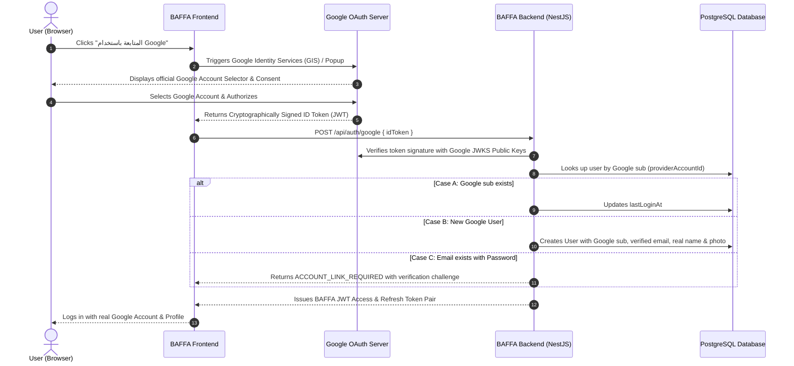

# BAFFA (بَفّة) — Google Sign-In Implementation & Security Audit

## Executive Summary
This document provides a comprehensive audit of the Google Sign-In mechanism in BAFFA, explaining the exact root cause of the simulated/mock behavior, security vulnerabilities, and detailing the full architectural roadmap to replace it with real production Google Identity Services (GIS) and cryptographic server-side validation.

---

## 1. Current Implementation & Flow Analysis

### Files Involved
- **Frontend**: [`apps/web/src/components/auth/AuthModal.tsx`](file:///c:/Users/AlHuda/Desktop/baffa/apps/web/src/components/auth/AuthModal.tsx)
- **Backend Service**: [`apps/server/src/modules/auth/auth.service.ts`](file:///c:/Users/AlHuda/Desktop/baffa/apps/server/src/modules/auth/auth.service.ts)
- **Backend Controller**: [`apps/server/src/modules/auth/auth.controller.ts`](file:///c:/Users/AlHuda/Desktop/baffa/apps/server/src/modules/auth/auth.controller.ts)
- **Database Schema**: [`apps/server/prisma/schema.prisma`](file:///c:/Users/AlHuda/Desktop/baffa/apps/server/prisma/schema.prisma)

### Exact Problem & Root Cause
1. **Frontend Simulation**:
   - In `AuthModal.tsx`, clicking *"المتابعة بحساب Google"* opened an in-app simulated view (`GOOGLE_CONSENT`) and created a handcrafted fake base64 JWT payload (`eyJhbGciOiJSUzI1NiJ9...`) with random `sub` IDs and hardcoded placeholders (`user@gmail.com`).
   - The browser never contacted `accounts.google.com` or initiated Google Identity Services (GIS).
2. **Backend Signature Bypass**:
   - In `auth.service.ts`, `jwt.decode(dto.idToken)` was used instead of cryptographic signature verification against Google's public JWKS certificates (`https://www.googleapis.com/oauth2/v3/certs`) or `google-auth-library`.
   - The backend accepted unverified client-supplied claims without validating Google's signature, issuer (`accounts.google.com`), or audience (`GOOGLE_CLIENT_ID`).

---

## 2. Security Vulnerabilities Identified
1. **Identity Spoofing**: An attacker could craft any arbitrary JWT and send it to `/api/auth/google`, gaining unauthorized access to any user account without Google authentication.
2. **Missing Cryptographic Signature Check**: Tokens were decoded rather than verified against Google's public keys.
3. **No OAuth State / Account-Linking Protection**: If an email already existed as a password account, Google auth could overwrite or merge without password verification.

---

## 3. Required Production Google Cloud Configuration

To operate with live Google accounts, the following configuration is required:

| Parameter | Environment Variable | Location | Description |
| :--- | :--- | :--- | :--- |
| **Google Client ID** | `GOOGLE_CLIENT_ID` / `NEXT_PUBLIC_GOOGLE_CLIENT_ID` | Backend (`.env`) & Frontend (`.env.local`) | OAuth 2.0 Web Client ID generated in Google Cloud Console. |
| **Google Client Secret** | `GOOGLE_CLIENT_SECRET` | Backend only (`apps/server/.env`) | Kept strictly on the backend (never exposed to browser). |
| **Authorized JavaScript Origins** | `http://localhost:3000` (Dev) / `https://baffa.eg` (Prod) | Google Cloud Console | Domains permitted to load Google Identity SDK. |
| **Authorized Redirect URIs** | `http://localhost:3000/api/auth/callback/google` | Google Cloud Console | Callback URLs for redirect-based OAuth flows. |

---

## 4. Recommended Production Architecture

---

## 5. Scope of Changes
1. Install `google-auth-library` in `@baffa/server`.
2. Implement server-authoritative token validation verifying signature, issuer (`https://accounts.google.com`), audience (`GOOGLE_CLIENT_ID`), expiry, and `email_verified`.
3. Integrate official Google Identity Services (`google.accounts.id.initialize` & `google.accounts.id.renderButton` / prompt popup) on the frontend.
4. Implement Case A (Existing sub), Case B (New user), Case C (Secure account linking for matching email).
5. Remove all mock/simulated Google logic from production code.
6. Add automated security tests for signature verification, expired tokens, audience mismatch, and account linking.
