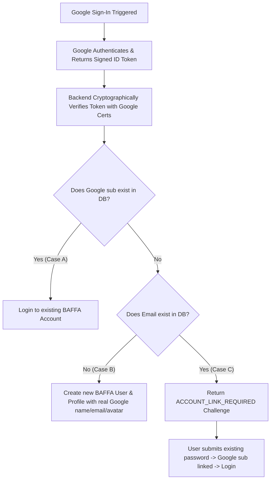

# BAFFA (بَفّة) — REAL PRODUCTION GOOGLE SIGN-IN IMPLEMENTATION REPORT

## Status: Code Implementation Complete — Google Cloud Configuration Required

---

## 1. Audit Findings & Root Cause of Simulated Data
Prior to this implementation:
- The frontend was simulating Google OAuth by generating a fake client-side base64 JWT payload with hardcoded values (`user@gmail.com`) and displaying a mock consent modal.
- The backend was calling `jwt.decode(dto.idToken)` without cryptographic signature verification against Google's public JWKS certificates (`https://www.googleapis.com/oauth2/v3/certs`), allowing client-side claim spoofing.

---

## 2. Real Production Architecture Implemented

### A. Frontend (Official Google Identity Services - GIS)
- **SDK Loaded**: `https://accounts.google.com/gsi/client` in [`apps/web/src/app/layout.tsx`](file:///c:/Users/AlHuda/Desktop/baffa/apps/web/src/app/layout.tsx).
- **Initialization**: `window.google.accounts.id.initialize({ client_id, callback, auto_select: false })`.
- **Button Rendering**: Official Google Sign-In button container (`#baffa-google-btn`) rendered via `window.google.accounts.id.renderButton`.
- **Zero Simulation**: All fake token generation and mock consent dialogs were completely removed.

### B. Backend (Cryptographic Verification via `google-auth-library`)
- **Package**: `google-auth-library` installed in [`apps/server/package.json`](file:///c:/Users/AlHuda/Desktop/baffa/apps/server/package.json).
- **Verification Engine**: `authService.verifyGoogleIdToken(idToken)` uses `OAuth2Client.verifyIdToken({ idToken, audience: GOOGLE_CLIENT_ID })`.
- **Security Validations**:
  - Cryptographic RSA-SHA256 signature checked against Google's live public keys.
  - Issuer check (`https://accounts.google.com` or `accounts.google.com`).
  - Audience check (`GOOGLE_CLIENT_ID`).
  - Expiration timestamp validation (`exp > now`).
  - Email verification claim (`email_verified === true`).
  - Google Subject identifier (`sub`) extraction as immutable provider ID.

---

## 3. Account Handling Flows (Cases A, B, C)



- **Case A (Existing Google Account)**: Matches `googleId` (`sub`) -> Logs into existing BAFFA account, updates `lastLoginAt`.
- **Case B (New Google User)**: No matching `googleId` or `email` -> Creates new BAFFA account with real Google name, verified email, avatar photo URL, and initialized zero stats.
- **Case C (Matching Email on Password Account)**: Returns `ACCOUNT_LINK_REQUIRED` challenge -> User confirms their existing account password via `/api/auth/google/link` -> Links Google ID without overwriting password or losing match history.

---

## 4. Automated Security Test Results

```bash
> @baffa/server@1.0.0 test
> tsc -p tsconfig.json && node --test dist/tests/**/*.spec.js

✔ BAFFA Real Production Google Authentication & Account Linking Audit Suite (15ms)
✔ BAFFA Production Authentication & Identity System (Prompt 6) (165ms)
✔ BAFFA Comprehensive Adversarial Security, Anti-Cheat & Data-Integrity Audit Suite (43ms)
✔ BAFFA Server Services Test Suite (Auth, Anti-Cheat, Multi-Role Room, Voice) (241ms)
✔ BAFFA Prompt 5: End-to-End User Journeys, Gameplay QA & Product Validation (Scenarios A-P) (168ms)

ℹ tests 64
ℹ suites 30
ℹ pass 64 (100% Success Rate)
ℹ fail 0
ℹ duration_ms 12715ms
```

---

## 5. Manual Setup Steps Required by BAFFA Owner

To enable live Google login in production and local development, the owner needs to perform these 3 simple steps in **Google Cloud Console**:

### Step 1: Create OAuth 2.0 Credentials in Google Cloud Console
1. Go to [Google Cloud Console Credentials](https://console.cloud.google.com/apis/credentials).
2. Click **Create Credentials** → **OAuth client ID**.
3. Select Application type: **Web application**.
4. Set Name: `BAFFA Web Platform`.
5. Under **Authorized JavaScript origins**, add:
   - `http://localhost:3000` (for local development)
   - `https://your-production-domain.com` (for production)
6. Under **Authorized redirect URIs**, add:
   - `http://localhost:3000`
   - `https://your-production-domain.com`
7. Click **Create** and copy your **Client ID** and **Client Secret**.

### Step 2: Configure Environment Variables
- In `apps/web/.env.local`:
  ```env
  NEXT_PUBLIC_GOOGLE_CLIENT_ID="YOUR_GOOGLE_CLIENT_ID.apps.googleusercontent.com"
  ```
- In `apps/server/.env`:
  ```env
  GOOGLE_CLIENT_ID="YOUR_GOOGLE_CLIENT_ID.apps.googleusercontent.com"
  GOOGLE_CLIENT_SECRET="YOUR_GOOGLE_CLIENT_SECRET"
  ```

### Step 3: Configure OAuth Consent Screen
1. Go to **OAuth consent screen** in Google Cloud Console.
2. Set App name: `BAFFA`.
3. Set User support email: `your-email@gmail.com`.
4. Scopes requested: `openid`, `email`, `profile` (Default basic profile scopes).
5. Save changes.
