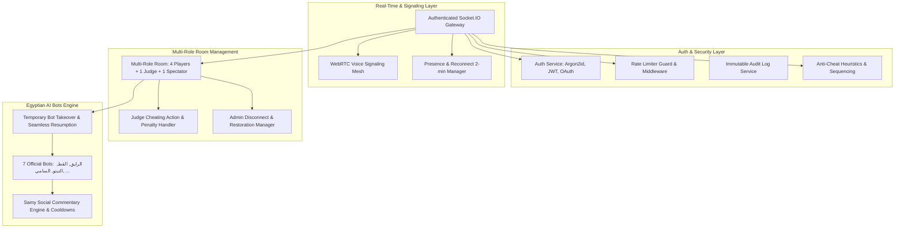

# BAFFA (بَفّة) — Prompt 2 Comprehensive Codebase Audit

**Date:** August 24, 2026  
**Auditor:** Lead Software Architect & Senior Full-Stack Game Engineer  
**Scope:** `packages/shared`, `packages/engine`, `apps/server`, `apps/web`, Prisma Schema, Socket.IO Gateway, Room Service, Game Engine, Bots, Security Boundaries.

---

## 1. Current Architecture Summary

The existing foundation created in Prompt 1 is structured as a TypeScript monorepo using npm workspaces:
- `packages/shared`: Centralized TypeScript interfaces for dominoes, rooms, events, and auth DTOs.
- `packages/engine`: Pure, zero-dependency server-authoritative domino game engine with 11 automated test suites covering 28-tile distribution, 6|6 round 1 opening, counter-clockwise progression, pass ("فوت") checks, and scoring for empty hand and blocked game ("قفلة").
- `apps/server`: NestJS real-time backend with Socket.IO gateway (`GameGateway`), in-memory room management (`RoomService`), session manager (`GameSessionService`), single heuristic bot (`BotService`), and Prisma ORM for PostgreSQL.
- `apps/web`: Next.js 14+ App Router frontend with CSS design tokens, responsive table layout, tactile `DominoTile` component, 2v2 opposite seating representation, and Socket.IO client.

---

## 2. Comprehensive Findings by Domain

| Category | Status | Finding & Analysis | Risk Level |
| :--- | :--- | :--- | :--- |
| **Authentication** | Partially Implemented | Client creates an ephemeral user object stored in `localStorage` without password hashing, sessions, or backend JWT verification. Prisma schema has `passwordHash` field but no auth controller/service exists. No Google OAuth verification. | **HIGH** |
| **Security & Tampering** | Partially Implemented | Hand sanitization exists (`getSanitizedState` masks opponent hands). However, socket handlers currently trust client-provided `userId` without verifying cryptographic JWT session tokens. | **HIGH** |
| **Role Authorization** | Partially Implemented | Admin actions check `room.ownerId === player.userId`, but Judge and Spectator roles are not yet modeled as first-class room positions or validated server-side. | **HIGH** |
| **Reconnection & Grace Period** | Partially Implemented | Basic socket disconnect marks player as disconnected, but the 2-minute disconnection timer, temporary bot takeover with human resumption, and admin transfer logic are not yet implemented. | **MEDIUM** |
| **Judge Mode & Cheating Action** | Missing | Room model lacks Judge seat (max 1), Judge UI, and server-authoritative "Declare Cheating" penalty event with round forfeiture. | **HIGH** |
| **Spectator Mode** | Missing | Room model lacks dedicated Spectator slot (max 1) and public-only state stream without private hand exposure. | **MEDIUM** |
| **Voice Chat (WebRTC)** | Missing | No WebRTC mesh signaling events (`voice_signal`, `voice_join`, `voice_leave`) or client media stream manager. | **MEDIUM** |
| **AI Bots System** | Partially Implemented | Only 1 basic bot exists (`BotService`). Missing the 7 official Egyptian bot personalities: *الرايق*, *القط*, *التيتو*, *السامي*, *رقم واحد في العزبة*, *الهيما*, *الهوبا*, with difficulty tiers and Samy's social commentary. | **MEDIUM** |
| **Anti-Cheat & Audit Logging** | Partially Implemented | Server validates turns, ownership, and chain matching. Missing action sequence numbers, impossible move timing detection, suspicious client risk scoring, and immutable audit logs. | **HIGH** |
| **Rate Limiting** | Missing | WebSocket and HTTP endpoints have no throttling or IP/session rate limits. | **MEDIUM** |
| **Screen / App Visibility** | Missing | Frontend does not track `visibilitychange` or window blur to notify the room of player backgrounding/absence. | **LOW** |

---

## 3. Detailed Security & Data Leakage Review

1. **Private Domino Hand Leakage**:
   - **Audit Result**: PASS. `DominoGameEngine.getSanitizedState(forSeat)` only includes `myHand` for the requesting seat and sets `hiddenTilesCount` for others. Opponent hands are never serialized in public game state.
   - **Improvement Needed**: Ensure Judge, Spectator, and Reconnection payloads strictly use `getSanitizedState(null)` or seat-specific sanitization.

2. **Session Hijacking & Client Impersonation**:
   - **Audit Result**: Socket events currently accept `payload.user.id` directly from the client. A malicious client could emit `admin_start_match` or `play_tile` claiming to be another user ID.
   - **Required Fix**: Implement JWT authentication on WebSocket handshake and extract verified `userId` directly from socket auth session.

3. **Password Hashing & User Registration**:
   - **Audit Result**: No registration/login REST endpoints exist yet.
   - **Required Fix**: Add Argon2id / bcrypt password hashing, input normalization (lowercase username/email), database unique constraints, refresh token rotation, and Google OAuth token verification.

---

## 4. Required Architecture Changes for Prompt 2

---

## 5. Execution Plan & Risk Mitigation

1. **Database & Auth Foundation**: Extend Prisma schema with Session, AuditLog, CheatingEvent, and OAuth models. Implement NestJS Auth module with Argon2id and JWT.
2. **Multi-Role Seating (Players + 1 Judge + 1 Spectator)**: Update `packages/shared` and `RoomService` to strictly enforce role limits and public-only streams.
3. **Reconnection & 2-Minute Grace Timer**: Implement timer-based bot takeover, state reconciliation, and admin transfers.
4. **7 Egyptian AI Bots with Personalities**: Build bot difficulty engine and Samy social chat trigger system.
5. **WebRTC Voice Signaling**: Add peer-to-peer signaling gateway and frontend audio controls.
6. **Layered Anti-Cheat & Audit Logging**: Implement sequence validation, move timing analysis, and append-only audit trail.
7. **Frontend UI Polish**: Add Judge view, Spectator view, Voice controls, and visibility detection.
8. **Automated & Security Tests**: Verify all scenarios and write comprehensive test suites.
